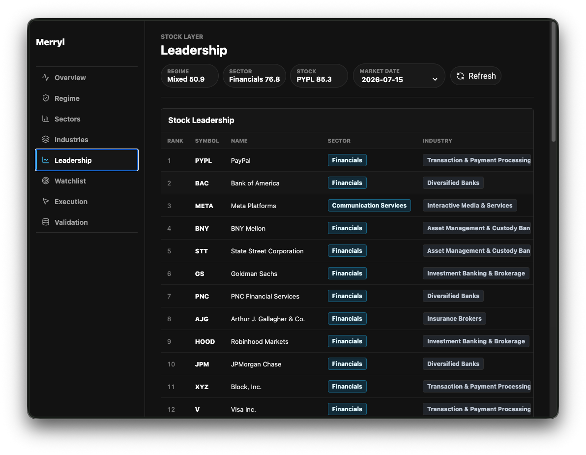

<h2 align="center">Merryl</h2>

<p align="center">
  
</p>

----

Merryl is a market rotation intelligence engine. It pulls real market and context data, scores the market from the top down, stores the history in SQLite, writes a daily report, and serves a read-only dashboard.

The system helps answer one question: where is money moving, why might it be moving, and which names are worth charting from that part of the market?

Merryl is a decision-support tool for market review. It does not execute trades, size positions, manage risk, or replace chart review.

More background is in the [market rotation system spec](docs/market_rotation_system_spec.md).

----

## To start using Merryl

See the [setup guide](docs/setup_guide.md) for prerequisites, API key setup, and environment configuration.

Quick start:

```bash
cp .env.example .env
# Edit .env with your API keys
npm --prefix dashboard install
npm --prefix dashboard run build
cargo run -- db migrate
set -a; source .env; set +a
cargo run -- run daily --date latest
```

If those commands work, the local setup is ready.

## To start developing Merryl

```bash
git clone <repo-url>
cd merryl
cargo build
cargo test
```

The normal daily loop:

```bash
set -a; source .env; set +a
cargo run -- run daily --date latest
cargo run -- doctor
cargo run -- status
cargo run -- dashboard
```

Each daily run writes `data/market.db`, `reports/YYYY-MM-DD_market_report.md`, `exports/YYYY-MM-DD_sector_scores.csv`, and `exports/YYYY-MM-DD_stock_watchlist.csv`.

Backtests and validation read from SQLite only:

```bash
cargo run -- run backtest --from YYYY-MM-DD --to YYYY-MM-DD
```

See the [CLI reference](docs/cli_reference.md) for all commands and options.

## Architecture

Merryl follows a top-down flow: broad market regime, then sector rotation, then industries and themes, then individual stocks, then actionability classification. By the time a ticker appears in the watchlist, it has already passed through market, sector, industry, liquidity, relative strength, volume, and context checks.

The daily workflow is the single source of truth. The dashboard is always a reader -- it never fetches data or recalculates scores.

See the [architecture overview](docs/architecture_overview.md) for the full system design.

## Data sources

Merryl uses real sources only. It does not generate fake production candles.

[Alpaca Market Data](https://docs.alpaca.markets/docs/market-data-faq) provides daily OHLCV and recent news. [FRED](https://fred.stlouisfed.org/docs/api/fred/) provides macro context such as rates, volatility, inflation, employment, credit, and liquidity series. [Alpha Vantage](https://www.alphavantage.co/documentation/) provides structured earnings calendar context. [SEC EDGAR APIs](https://www.sec.gov/search-filings/edgar-application-programming-interfaces) provide recent filing events.

The first universe is the S&P 500 with major broad-market and sector ETFs. See [data sources](docs/data_sources.md) for full details.

## Static dashboard

Merryl can publish a zero-server dashboard snapshot through GitHub Actions and GitHub Pages. The Action runs the same Rust workflows, runs backtest validation over the generated scored-date window, builds the React dashboard in static mode, exports dashboard JSON from SQLite, and publishes `dashboard/dist`.

Required repository Secrets: `ALPACA_API_KEY_ID`, `ALPACA_API_SECRET_KEY`, `FRED_API_KEY`, `ALPHA_VANTAGE_API_KEY`, `MERRYL_SEC_USER_AGENT`.

Manual local export:

```bash
npm --prefix dashboard run build
cargo run -- dashboard --export-static dashboard/dist/static-data
```

See the [static dashboard deployment spec](docs/static_dashboard_deployment_spec.md) for details.

## Key docs

[Setup guide](docs/setup_guide.md) -- [Architecture overview](docs/architecture_overview.md) -- [CLI reference](docs/cli_reference.md) -- [Data sources](docs/data_sources.md)

[Market rotation system spec](docs/market_rotation_system_spec.md) -- [MVP technical plan](docs/mvp_technical_plan_spec.md) -- [Phase 0 decisions](docs/phase_0_decisions_spec.md)

[Implementation runbook](docs/implementation_spec.md) -- [Static dashboard deployment](docs/static_dashboard_deployment_spec.md) -- [Phase 5 data-source expansion](docs/phase_5_data_source_expansion_spec.md)

[Structured catalyst source spec](docs/phase_5c_structured_catalyst_source_spec.md) -- [Watchlist convergence review](docs/watchlist_convergence_review_spec.md) -- [Watchlist actionability filter](docs/watchlist_actionability_extension_filter_spec.md)

## Boundary

Merryl is a decision-support tool for market review. It does not provide financial advice, execute trades, manage positions, or replace chart/risk review.
